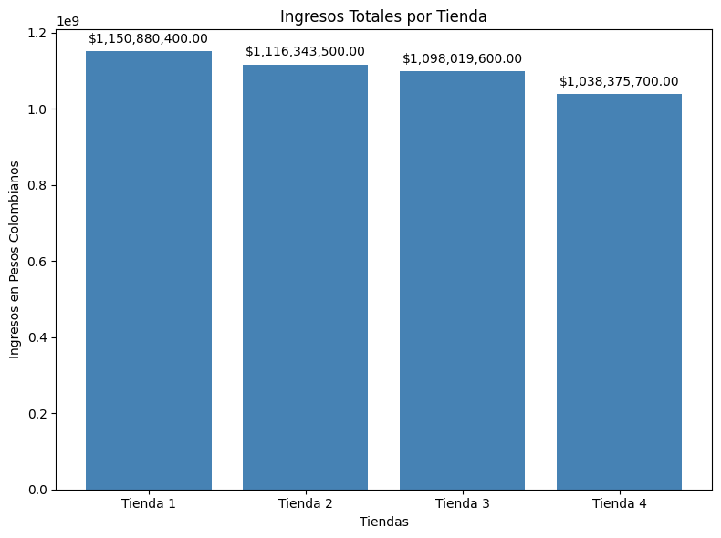
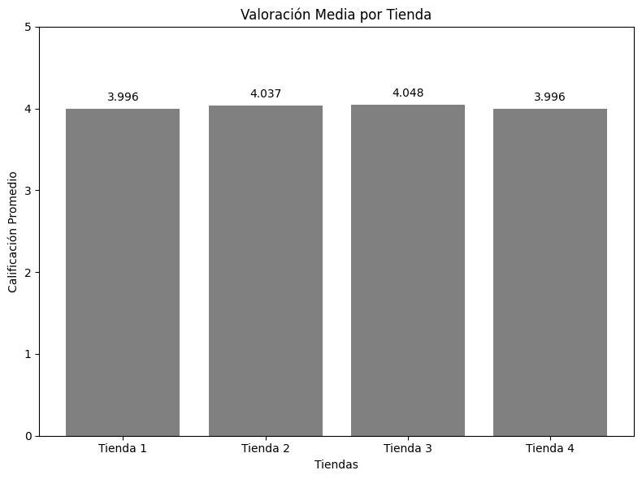
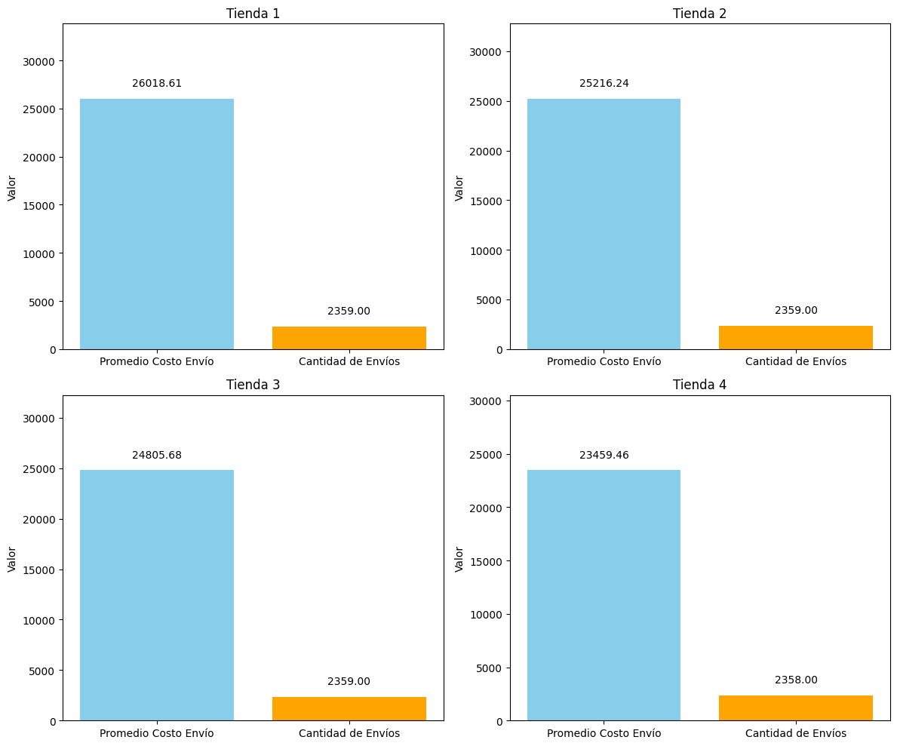

Este es el challenge de Alura Latam en el cual se realizó un análisis de cuatro tiendas para determinar cuál es la que se debería vender. Para esto se tomaron en cuenta las categorías de ingresos totales, valoración media, y promedio del precio de envíos.

Este analisis esta dividido en 5 partes:
- Análisis de facturación.
- Ventas por categoría.
- Calificación promedio de la tienda.
- Productos más y menos vendidos.
- Envío promedio por tienda.

A continuación, algunos de los gráficos que fueron claves al tomar la decisión:

En esta gráfica se puede observar que la Tienda 1 es la que más ingresos totales tiene y por otra parte la que menos ingresos ha generado es la Tienda 4.

En esta grafica se puede observar que las Tiendas 1 y 4 son las que menos valoracion media tienen.

En el siguiente gráfico se puede observar que el promedio del precio para la Tienda 4 es el menor y el de la Tienda 1 es el mayor.
